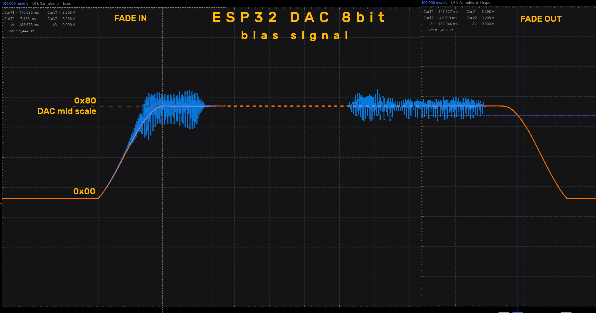
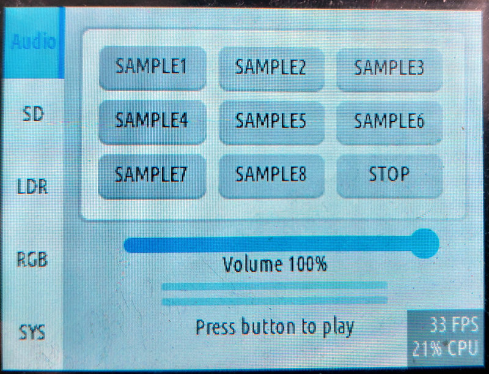
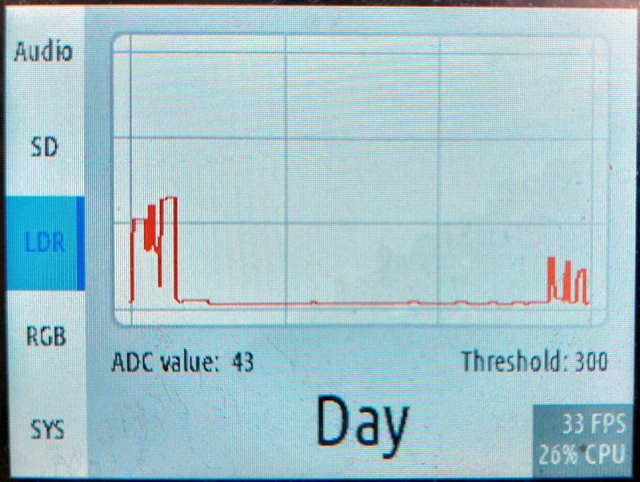
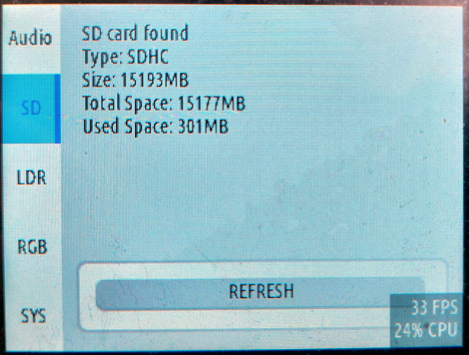
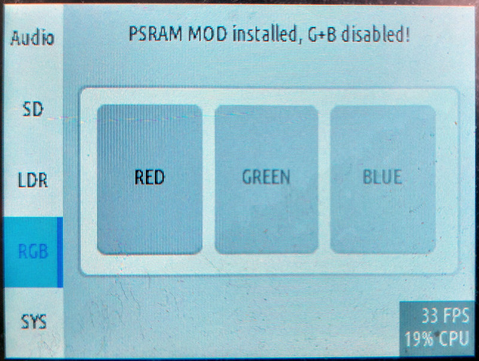
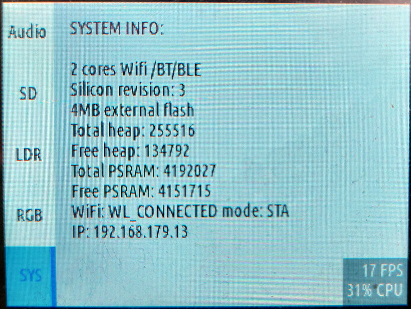

# ESP32-2432S028 base project example 

Complete, optimized for the hardware starting project for the 2.8" version of the Cheap Yellow Display.  

## Configuration:  
in `platformio.ini` set  
*  **default_envs = esp32devCYD_STOCK**  
for stock, umnodded board version. 
* **default_envs = esp32devCYD_MOD**  
for modded version of the board

Depending on the performed mods, one or more of the build flags has to be enabled/disabled:  
```
[env:esp32devCYD_MOD]
build_flags = 
            	-DCORE_DEBUG_LEVEL=3
            	-DBOARD_HAS_PSRAM						# PSRAM mod used - no RGB LED
	          	-mfix-esp32-psram-cache-issue			#
 				-mfix-esp32-psram-cache-strategy=memw	#
			  	-DUSE_BACKLIGHT_MOD						# TFT fixed backlight mod used, will free up the GPIO21
				-DAUDIO_LOG 							# enable log info in the audio library
				-DLV_CONF_INCLUDE_SIMPLE
```  
Adjust the settings corresponding to your board version and click upload.  
**Caution!** if a firmware with PSRAM enabled is written to a board without PSRAM it will most likely end in a boot loop.

## CYD_Audio  
The CYD_Audio library is based on [ESP32-audioI2S library by Wole (schreibfaul1)](https://github.com/schreibfaul1/ESP32-audioI2S). Some parts of it are non functional at the moment (EQ, balance, external processing) and might be added in the future.   
Audio system runs in a separate task and the communication is done using RTOS queues. The most used commands like:  
- playing streams, 
- playing files from an SD card, 
- setting and getting the volume,
- stopping the play  
  
are already predefined. Look at the `CYD28_audio.cpp` and `CYD28_audio.h` files for the used methods.  
New add ons, optimizations:  

- replaced heavy float + double precision calculations with integer ones in the volume scalling,  
- output sample processing and i2s write is done in blocks instead of sample by sample procedure,
- fixed annoying "click" at the stard and end of a sample when using the internal DAC by slow ramp up/down the mid scale  
  
- added a few useful functions like Volume Up/Down to be used with touch screen interface,  
- added stereo RMS level detector for use with VU meters and possibly with dynamic based effects in the future (volume limiter, automatic level etc.).  
  
* Copy the 3 files found in the **Samples** directory onto an SD card and plug it in.  
* Press buttons to play samples, try TTS speech systhesis, stream an audio file or web radio.
* commands are ececuted in `gui.cpp` file in function `event_handler_btnsAudio(lv_event_t * e)`
  
### Note  
**OGG Vorbis and FLAC decoders will work only with PSRAM mod installed.  
Streaming audio might also be problematic due to not enough RAM available for buffers.**

## CYD28_Display  
Display driver combines TFT_eSPI library with LVGL8.3.9 using dual buffered write method.  Dedicated SPI: HSPI (directly assigned pinout, no gpio mux used).  

## CYD28_LDR  
Light dependent resistor used to measure the ambient light level has it's own library.
Following features are implemented:  
- IIR filter for smooth readout,
- threshold + hysteresis as day/night detector.  
- 
  
  
## CYD28_SD  
SD card runs on a separate SPI (VSPI). Basic init and file operations are provided. SD is used in the audio library to play wav, mp3, ogg, flac, mp4 files.  

  

## CYD28_Touchscreen  
The touchscreen interface is available on completely different pins as both SPI interfaces. Leaving teh HSPI and VSPI buses dedicated for the display and SD card, touchscreen controller (XPT2046) uses a new bit banged software SPI.  
Touchscreen is incorporated into the LVGL graphics library.  

## CYD28_RGBLED  
Library for accessing the onboard RGB led. In case of PSRAM mod (using gpio18, 19) two of the leds are not available.  

  
## SimpleCLI  
Basic command console via USB uart. Two commands are avaialble:  
- list all the files found on the SD card,
- play audio file stored on the SD card.  
## WiFiManager  
WiFiManager library is included to provide easy network setup. This is the only library added via lib_deps in platformio.ini to keep it updated. 

## System Info  
**SYS** tab on the main screen shows basic hardware information about the chip, WiFi status and IP address.  
 

---  
(c) 08.2023 by Piotr Zapart  
www.hexefx.com  