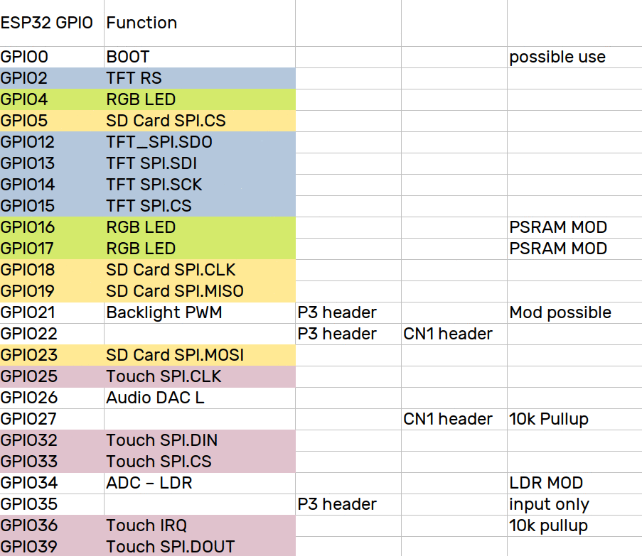
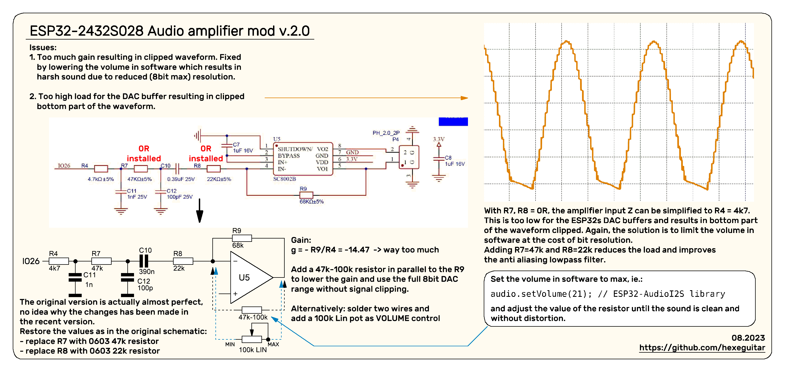
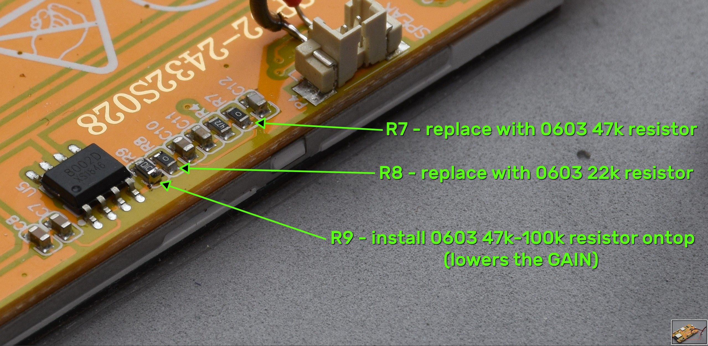
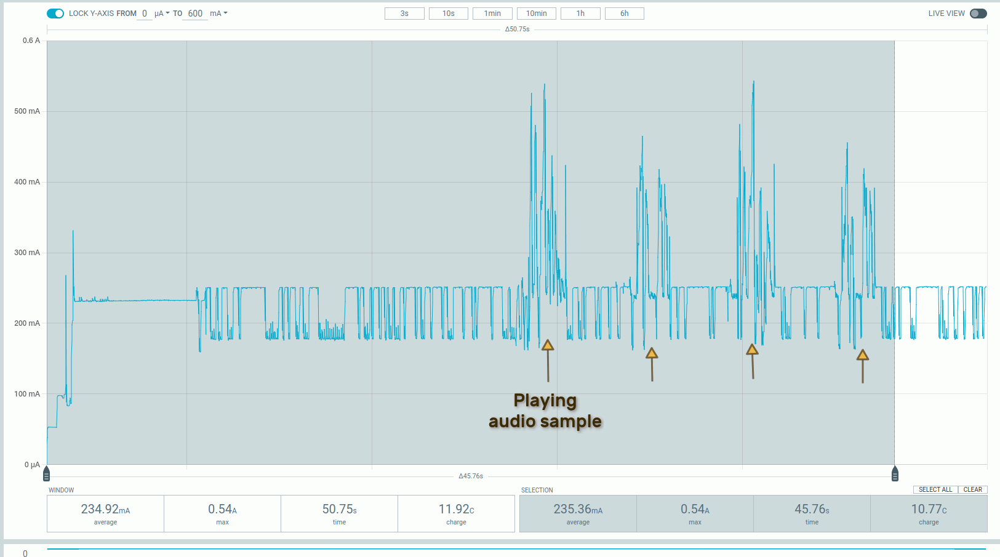
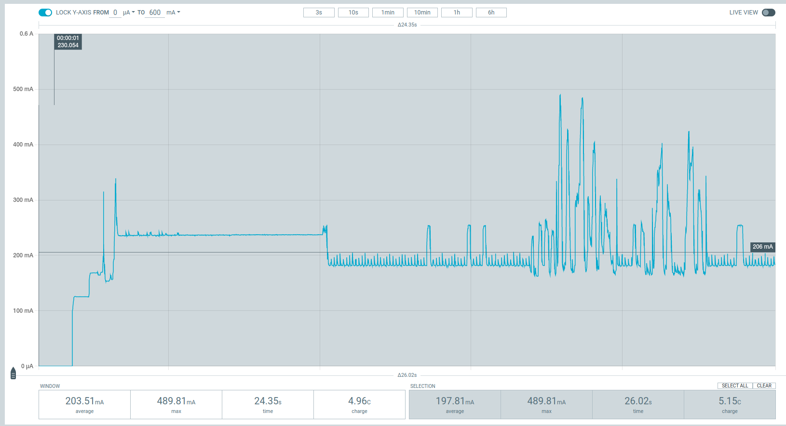
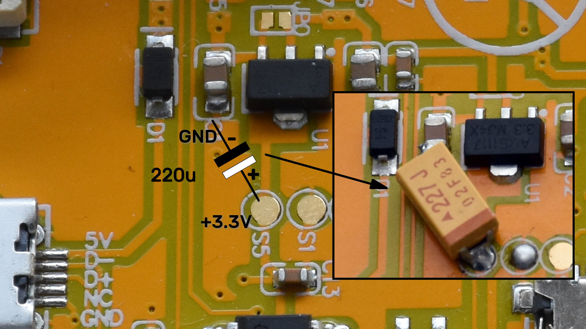

# ESP32-2432S028 aka Cheap Yellow Display example project  

A complete PlatformIO starting project for the ESP32-2432S028 aka Cheap Yellow Display board consisting of:
* custom drivers/libraries optized for the used hardware  
* LVGL v.8.3.9 graphics library
* rewritten and adapted for internal DAC audio library (see the mods below)  
  
[See here](Examples/CYD28_BaseProject/README.md) for more details about the project.  

---  
### Changelog  
* Aug 28th, 2023: Major update, completely new project using LVGL8, custom libraries. 
* Jun 16th, 2023: Added more hardware mods, audio library and example using google TTS
* Jun  6th, 2023: Initial commit, basic PIO project using lvgl library
---
### Pin Mapping 

---
## Recommended modifications and technical details
1. [LDR light sensor mod](#ldr)  
2. [Audio amp gain mod](#2-audio-amp-gain-mod)
3. [Adding PSRAM](#adding-psram)  
4. [GPIO21 mod](#free-up-the-gpio21)
5. [Current consumption](#current-consumption)
### 1. LDR  
Extends the light sensor read range and smooths out the curve.

LDR readout before the mod:  

and after:
  
### 2. Audio amp gain mod  
The default configuration for the onboard audio amplifier has way too much gain (x14.5) resulting in nasty distortion and clipping. Software method to cope with that would be to reduce the volume of the signal. However, with 8bit DAC + low volume setting the resulting resolution will be so much reduced the sound be again distorted.  
Another discovered problem was the input impedance of the amplfier (roughly 4k7) posed too much load for the ESP32's DAC buffers, resulting in a clipped half of the waveform.  

  
Sound quality can be greatly improved with a relatively simple modification requiring to replace a few components:  
  
For more detailed description see video:  

### 3. Adding PSRAM  
4MB of PSRAM can be added ad the cost of the installed RGB led (well 2/3 of it). In my opinion additional memory will be more useful for multimedia heavy application the board is intended to than a single led placed on the back of the board.  
There is a SOIC8 footprint provided for a extra flash chip. We can use it for PSRAM as it shares most of the pins with flash - except two:  
* clock (has to be **GPIO17**)  
* chip select (has to be **GPIO16**)
    
Both gpios are used by the RGB led. After removing it we can cut the existing tracks for the two above signals and rewire them to corresponding led pads. Both pins will have 1k pull up resistors. For the CS it is required, for the CLK it doesn't matter except maybe a bit higher current consumption. R16 can be removed if necessary.  
  
Having a led onboard might be handy while debugging, the red part of the RGB led (middle pins) can be used to add a 1206 led as shown on the pic. This led is available on **GPIO4**.  
#### Suitable PSRAM chips:  
* APS6404L-3SQR-SN  - 64Mbit (8MB) version, ESP will map only half of it. (Mouser#  878-APS6404L-3SQR-SN) 
* APS1604M-3SQR-SN  - 16Mbit (2MB) version, probably enough for audio streaming and decoders. (Mouser# 878-APS1604M-3SQR-SN)  
  
What is important - it has to be the **3**SQR version. Models without **3** are 1.8V ones. Won't work in the CYD. 

### 4. Free up the GPIO21  
**GPIO21** default use is PWM backlight control for the display. It is also available on the P3 connector. We can fix the backlight brightness to 100% and free up the GPIO21 for other tasks.  The mod requires to do the following:  
1. Remove the Q2 - n-mosfet used to pwm the backlight.
2. Remove the R10 10k pull down resistor.
3. Rotate the R11, 3R9 current limiting resistor 90° and solder it to the R10's ground terminal.  
   

### 5. Current consumption  
With the audio amp gain mod the current spikes while playing audio can reach over 500mA as shown on the plot:  
  
The spikes already exceed the max current an USB2.0 port can deliver and might lead to MCU brownouts if the USB port has a dedicated power controller limiting the output current to max allowed value. I would recommend plugging this board via an active (powered) USB hub.  
The next modification might be risky because it abuses the USB standard of max allowed VBUS capacitance. In practice, when using a powered USB hub i found it causes no problems, nevertheless - do it at your own risk!  
Adding a larger capacitance, in my case an C size 220uF/6.3V tantalum capacitor reduced the spikes to about 490mA when playing audio:  
  
There are two 3.3V rails on the CYD board:  
* dedicated entirely for the ESP32
* pheripheral 3.3V bus used for SD card, display and the audio amp.  
Capacitor has to be added to the second power rail. An easy access point is the Test Point **S5** and the ground terminal of **C1** 
    

---
Check out this link for more information and examples for this board:   
https://github.com/witnessmenow/ESP32-Cheap-Yellow-Display
