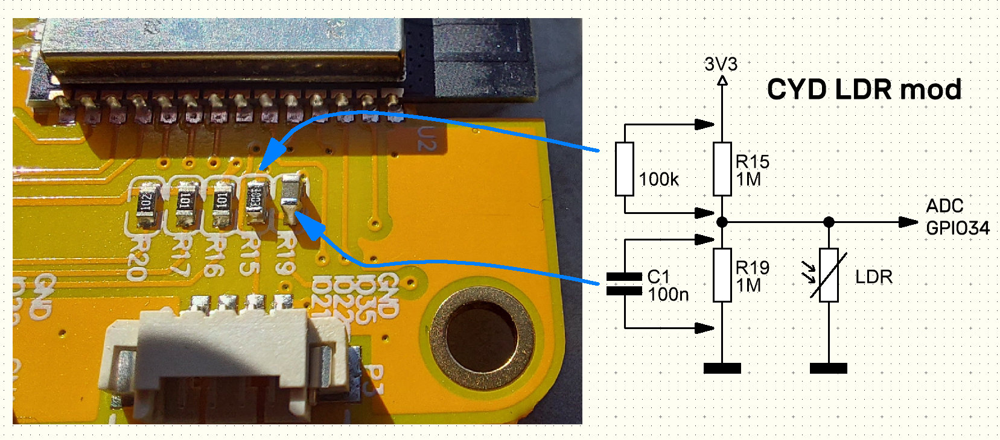
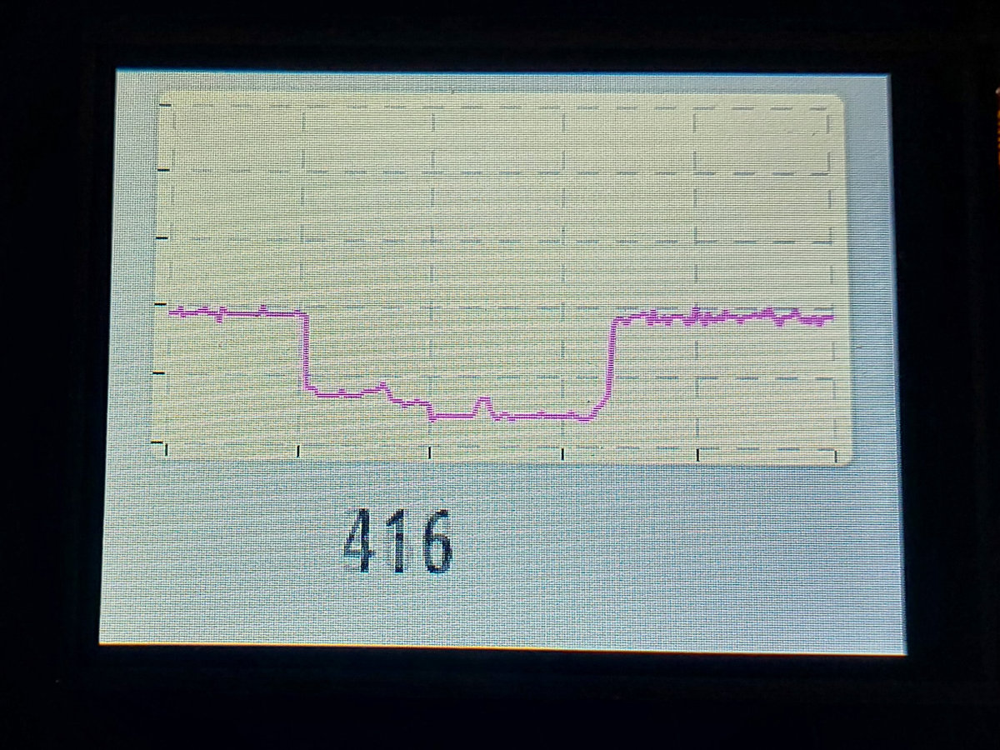
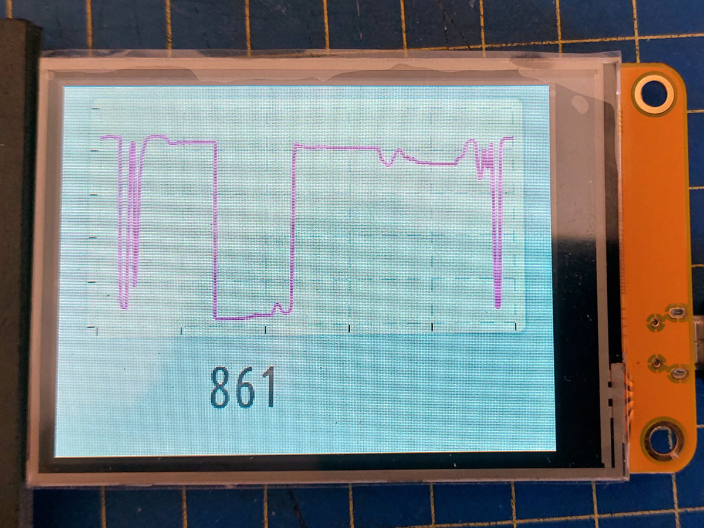
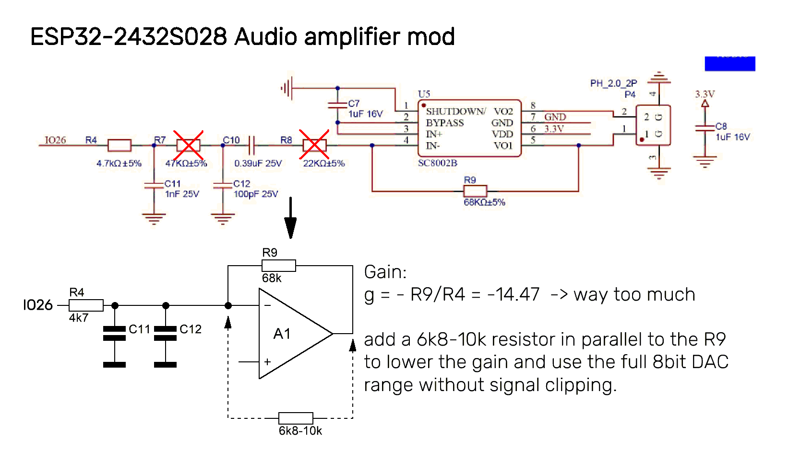
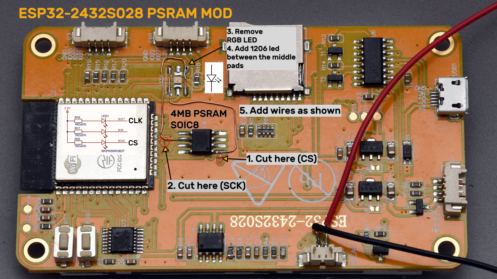
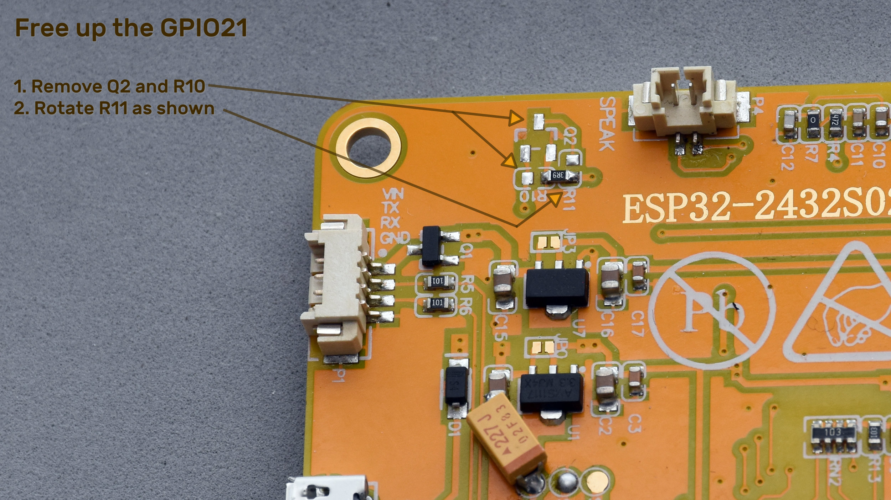

# ESP32-2432S028 example project  
using PlatformIO and LVGL v7, onboard LDR and RGB led.  
**WARNING! The example project requireds hardware mods 1, 2 and 3.**  

---  
### Changelog  
* Jun 16, 2023: Added more hardware mods, audio library and example using google TTS
* Jun  6, 2023: Initial commit, basic PIO project using lvgl library

---
## Recommended modifications  
1. [LDR light sensor mod](#ldr)  
2. [Audio amp gain mod](#2-audio-amp-gain-mod)
3. [Adding PSRAM](#adding-psram)  
4. 
### 1. LDR  
Extends the light sensor read range and smooths out the curve.

LDR readout before the mod:  

and after:
  
### 2. Audio amp gain mod  
The default configuration for the onboard audio amplifier has way too much gain (x14.5) resulting in nasty distortion and clipping. Software method to cope with that would be to reduce the volume of the signal. However, with 8bit DAC + low volume setting the resulting resolution will be so much reduced the sound be again distorted.  
  
Luckily for the used power amp chip the gain can be set using the feedback resistor, just like with regular opamps. To lower the gain the resistance has to be decreased by simply putting another lower value resistor across the R9. With my board and speakers i tried the optimal value was around 10k.  
With the reduced gain we can set the software volume to 100% and make use of the whole 8bit dynamic range.  
  
### Adding PSRAM  
4MB of PSRAM can be added ad the cost of the installed RGB led (well 2/3 of it). In my opinion additional memory will be more useful for multimedia heavy application the board is intended to than a single led placed on the back of the board.  
There is a SOIC8 footprint provided for a extra flash chip. We can use it for PSRAM as it shares most of the pins with flash - except two:  
* clock (has to be **GPIO17**)  
* chip select (has to be **GPIO16**)
    
Both gpios are used by the RGB led. After removing it we can cut the existing tracks for the two above signals and rewire them to corresponding led pads. Both pins will have 1k pull up resistors. For the CS it is required, for the CLK it doesn't matter except maybe a bit higher current consumption. R16 can be removed if necessary.  
  
Having a led onboard might be handy while debugging, the red part of the RGB led (middle pins) can be used to add a 1206 led as shown on the pic. This led is available on **GPIO4**.  
### Free up the GPIO21  
**GPIO21** default use is PWM backlight control for the display. It is also available on the P3 connector. We can fix the backlight brightness to 100% and free up the GPIO21 for other tatks.  The mod requires to do the following:  
1. Remove the Q2 - n-mosfet used to pwm the backlight.
2. Remove the R10 10k pull down resistor.
3. Rotate the R11, 3R9 current limiting resistor 90° and solder it to the R10's ground terminal.  
   

---
Check out this link for more information and examples for this board:   
https://github.com/witnessmenow/ESP32-Cheap-Yellow-Display
